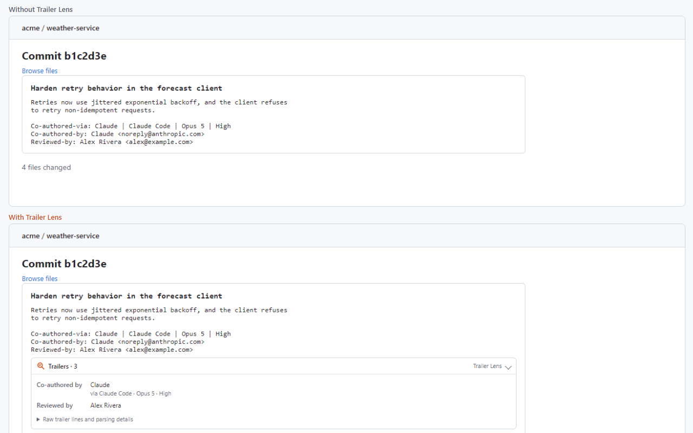
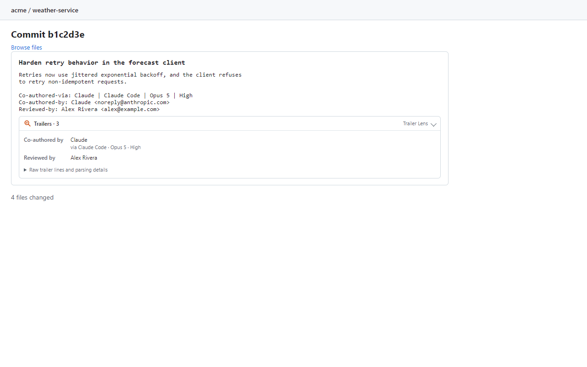
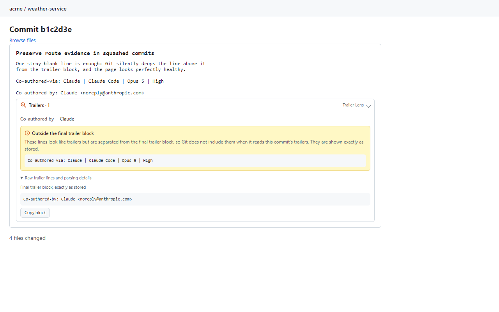
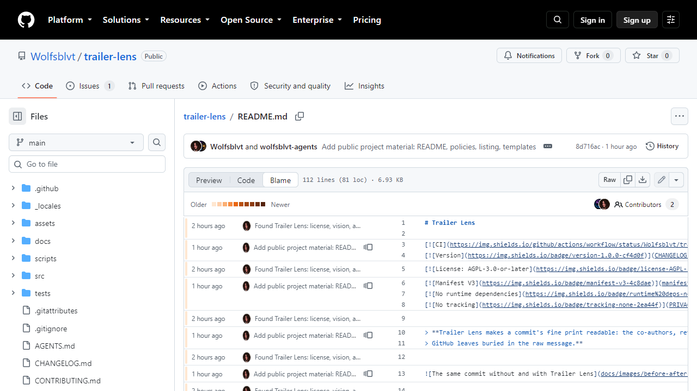
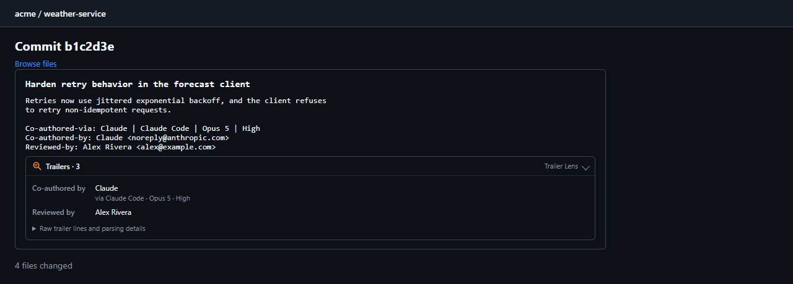

# Trailer Lens

> **Trailer Lens makes a commit's fine print readable: the co-authors, reviews, sign-offs, and custom metadata that
> GitHub leaves buried in the raw message.**

Git commit messages routinely end in structured [trailers](https://git-scm.com/docs/git-interpret-trailers) —
`Co-authored-by`, `Reviewed-by`, `Signed-off-by`, `Fixes`, `Change-Id`, custom team conventions. That structure is
real evidence stored in the repository, and GitHub shows almost none of it. Trailer Lens is a Chrome extension that
adds a compact panel to commit pages showing exactly what the commit declares — parsed the way Git parses it, with
everything Git would silently ignore still visible and labeled as such.

## What it shows

- **Co-authors, with their exact names.** Even where GitHub's native header collapses several people into one
  account, the panel shows each `Co-authored-by` exactly as written — and pairs a `Co-authored-via` route line (as
  used by AI pair-programming setups) with its co-author when the relation is unambiguous.

  

- **Reviews, sign-offs, tests, references.** `Reviewed-by`, `Signed-off-by`, `Acked-by`, `Tested-by`, `Reported-by`,
  `Fixes`, `Change-Id`, `Link`, and friends get friendly labels for scanning; the exact key is always one disclosure
  away in the raw block.
- **Custom metadata.** Unknown trailer keys stay visible by default. Your team's conventions are evidence, not noise.
- **Malformed evidence.** One stray blank line — even a line containing only a space — silently drops a trailer from
  what Git itself parses, while the page looks healthy. Trailer Lens shows the dropped line, plainly labeled, exactly
  as stored:

  

- **The exact raw block**, copyable, with source order, repeated keys, casing, and spacing preserved.
- **Remembered evidence where commits are only referenced** *(optional, off by default)*: enable *device-local
  memory* in the settings and commit pages you visit remember their parsed trailers on your device, so blame views,
  release pages, and PR/issue timelines show a small lens chip for commits you have already seen — clearly labeled
  as remembered, keyed by the full commit ID, never guessed from a short hash, and never synced or sent anywhere.

  

Dark mode, dark-dimmed, and forced-colors follow GitHub's own theme:

## What it never does

- It never edits commits, repository content, or any native GitHub element — the panel is a clearly-marked addition
  beside GitHub's own presentation, and GitHub's signature/verification state stays untouched and unimitated.
- It never claims a trailer is *true*. Trailers are declarations written by whoever created the commit; Trailer Lens
  shows them as such. A `Signed-off-by` is not a cryptographic signature, and a name in a trailer is not proof a
  person acted.
- It never talks to any server. No GitHub token, no API calls, no backend, no analytics, no telemetry, no remote
  code, no external assets. Private repositories work because your signed-in browser can already see the page — the
  extension has no access of its own. Page content is stored only if you explicitly enable device-local memory, and
  then only parsed trailer evidence, only on your device, with purge controls. See [PRIVACY.md](PRIVACY.md) for the
  whole (short) story.

## Supported surfaces

Commit pages — `github.com/<owner>/<repo>/commit/<sha>` — public and private, including commit pages reached from
repository history and pull requests, are where evidence is read. Surfaces that only *reference* a commit without
carrying its full message show nothing by default: rendering trailers there would require API calls and a token,
which this product refuses by design. With **device-local memory** enabled, blame views, release pages, and PR/issue
timeline references additionally show remembered chips for commits you have already visited — still with no network
access, and an unremembered commit still shows nothing rather than a guess. History and PR commit lists are
candidates for a later release behind the same boundary.

## Installation

**Chrome Web Store:** *not yet published — the listing link will land here when the first Store release is live.*

**From a release (side-load):**

1. Download `trailer-lens-<version>.zip` from the [latest release](https://github.com/Wolfsblvt/trailer-lens/releases)
   (verify it against the `.sha256` asset if you like).
2. Extract it, open `chrome://extensions`, enable **Developer mode**, click **Load unpacked**, and pick the extracted
   folder. Side-loaded copies do not auto-update.

**From source:** `npm install && npm run build`, then load the `dist/` folder the same way.

## Settings

The options page (right-click the toolbar icon → Options) has six controls, live in every open tab: enable, detail
density (auto / compact / expanded), diagnostics, unknown-key visibility, hidden keys, and device-local memory (off
by default, with stored-size stats and per-repository or complete purge). The raw block is never filtered. Reset and
purge-everything are two-step and cannot be hit by accident.

## How it reads trailers

The parser models what Git reports for **committed** messages — pinned against real Git by a two-channel oracle
corpus of 45 fixtures (see [docs/DEVELOPMENT.md](docs/DEVELOPMENT.md)). Strict trailers and nearby trailer-shaped
lines outside the final block are separate things and stay separate; nothing is repaired or reordered.
Repository-local Git configuration (custom separators, `trailer.*` keys, a non-default comment character) cannot be
known from a rendered page and is honestly out of scope. Where GitHub renders a link inside a message (a shortened
issue URL, for example), the panel says so instead of guessing what the original bytes were.

## Development

Node ≥ 24, `npm install`, `npm test` — typecheck, lint, unit suites, build, browser suites (the real extension in
headless Chromium against deterministic fixture pages), deterministic packaging, package verification, and a smoke of
the exact extracted ZIP. [docs/DEVELOPMENT.md](docs/DEVELOPMENT.md) has the details,
[docs/ARCHITECTURE.md](docs/ARCHITECTURE.md) the runtime design, and [docs/DECISIONS.md](docs/DECISIONS.md) the
settled decisions with their reasons.

## Support and compatibility

[GitHub Issues](https://github.com/Wolfsblvt/trailer-lens/issues) are the support channel — bug reports, GitHub-DOM
breakage, parser specimens, and feature requests each have a template. Supported: current stable Chrome/Chromium on
desktop, current GitHub Web. GitHub redesigns are an expected hazard: the extension fails closed (no panel rather
than a wrong one), and adapter repairs are ordinary maintenance. No response-time promises; security reports go
through [SECURITY.md](SECURITY.md). Please never paste confidential commit content into public issues.

## License and affiliation

[AGPL-3.0-or-later](LICENSE) — improvements to modified or redistributed versions remain available to users and the
community. Trailer Lens is an independent open-source project and is not affiliated with or endorsed by GitHub or
Anthropic.
