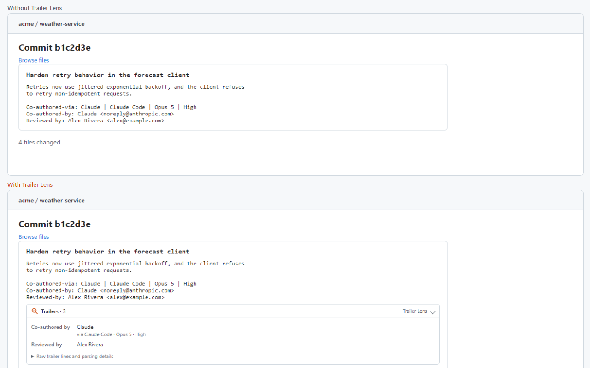
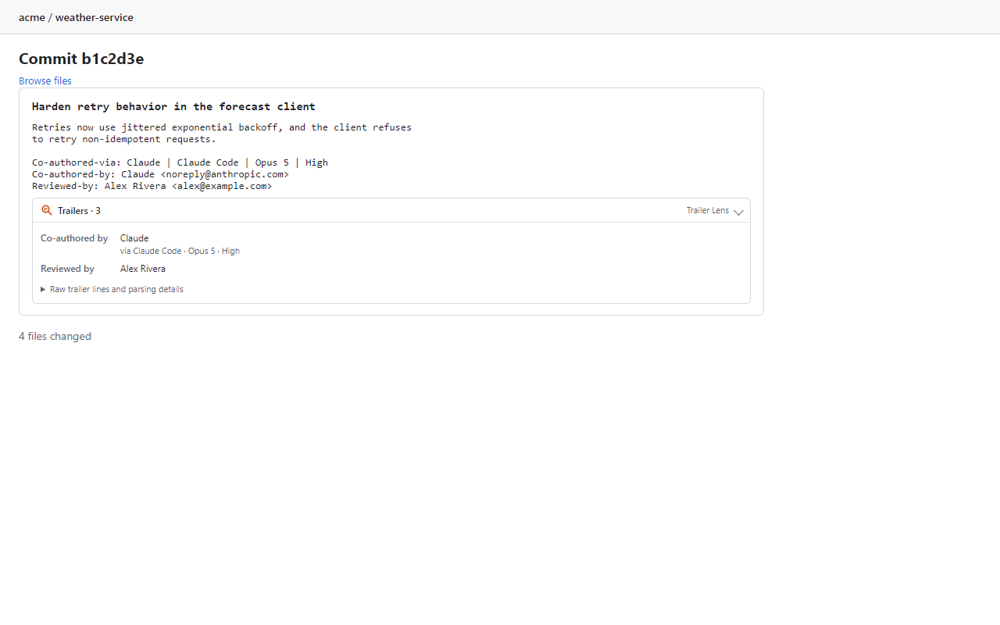
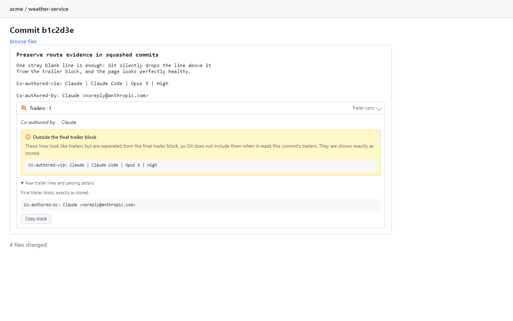
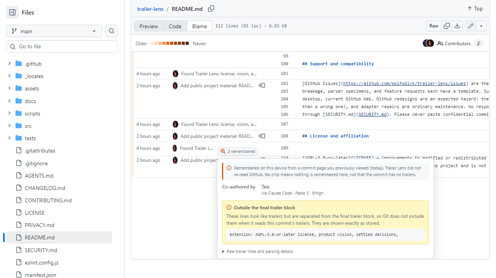
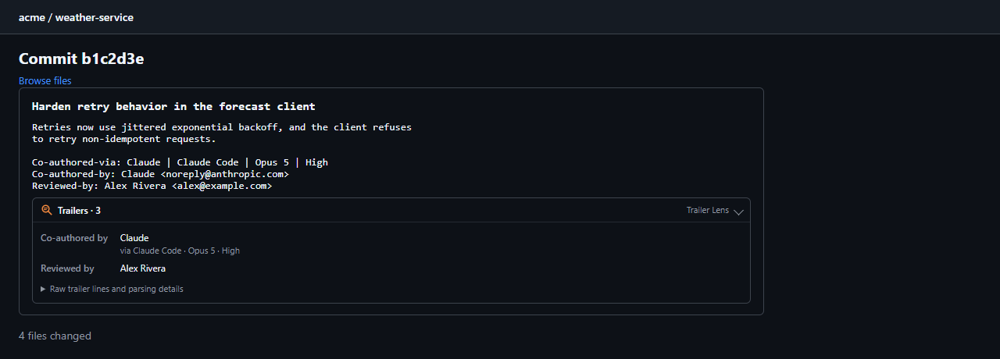

#  Trailer Lens

[](https://github.com/Wolfsblvt/trailer-lens/actions/workflows/ci.yml)
[](https://github.com/Wolfsblvt/trailer-lens/releases/latest)
[](manifest.json)
[](package.json)
[](privacy.md)

> **Trailer Lens makes a commit's fine print readable: the co-authors, reviews, sign-offs, and custom metadata that
> GitHub leaves buried in the raw message.**

**[Install the packaged release](#install-trailer-lens)** ·
[Build current `main`](#build-current-main) ·
[Privacy](privacy.md) ·
[Support](https://github.com/Wolfsblvt/trailer-lens/issues)

> [!IMPORTANT]
> **Availability:** the published `v1.1.0` GitHub release is the official side-load package and includes full
> commit-page panels plus optional device-local remembered chips. Compact trailer lines on PR and repository commit
> lists are currently source-only on `main`; they are not in that package. The Chrome Web Store listing is not
> published, and side-loaded copies do not auto-update.



Git commit messages routinely end in structured [trailers](https://git-scm.com/docs/git-interpret-trailers) —
`Co-authored-by`, `Reviewed-by`, `Signed-off-by`, `Fixes`, `Change-Id`, and legitimate custom keys. That structure is
real evidence stored in the repository, but GitHub shows almost none of it. Trailer Lens adds the missing reading
layer beside GitHub's own presentation: exact declarations, friendly labels, visible parsing boundaries, and no
pretence that a line in a message has somehow become verified truth.

## Read what the commit declares

- **People and provenance.** See every `Co-authored-by` exactly as written, even when GitHub collapses several people
  into one account summary. When the relation is unambiguous, Trailer Lens pairs a nearby `Co-authored-via` line with
  its co-author so the route context remains readable.
- **Reviews, sign-offs, tests, and references.** Common keys such as `Reviewed-by`, `Signed-off-by`, `Acked-by`,
  `Tested-by`, `Reported-by`, `Fixes`, `Change-Id`, and `Link` receive human-readable labels without losing their
  original key.
- **Custom conventions.** Unknown trailer keys stay visible by default. A team's own metadata is evidence, not noise.
- **Malformed evidence.** A stray blank line — even one containing only a space — can silently exclude a
  trailer-shaped line from Git's final trailer block. Trailer Lens keeps the excluded line visible and labels the
  distinction instead of repairing history.
- **The exact raw block.** Source order, repeated keys, casing, spacing, and a copy action remain available beneath
  the friendly view.





## Where the lens appears

| GitHub surface | What Trailer Lens shows | Availability |
| --- | --- | --- |
| Commit detail page | The complete evidence panel, diagnostics, and raw block | Packaged `v1.1.0` and `main` |
| PR conversation commit rows, PR **Commits**, repository **Commits/history** | A compact scan line plus keyboard-operable **Trailers N** disclosure, but only when the row proves a full commit ID, complete native message, and safe sibling anchor | Current `main` source build |
| Blame, release pages, and PR/issue timeline commit references | An optional **remembered on this device** chip for an exact full-ID hit from a commit page you previously visited | Packaged `v1.1.0` and `main`, with device-local memory enabled |
| Anything without enough evidence | Nothing — no API lookup, short-hash guess, or decoration of arbitrary user content | Deliberately unsupported |

Remembered evidence is always labeled, never fetched, and never inferred:



Light, dark, dark-dimmed, and forced-colors follow GitHub's own theme:



## Install Trailer Lens

Trailer Lens currently supports the stable desktop release of Chrome/Chromium and the current GitHub Web interface.

### Packaged release

1. Open the [latest GitHub release](https://github.com/Wolfsblvt/trailer-lens/releases/latest) and download
   `trailer-lens-<version>.zip`. The sibling `.sha256` asset is available for checksum verification.
2. Extract the archive.
3. Open `chrome://extensions`, enable **Developer mode**, choose **Load unpacked**, and select the extracted folder.
4. Open a GitHub commit page containing trailers. The first success signal is a **Trailer Lens** panel directly below
   the commit message; a page the adapter cannot qualify intentionally receives no panel.

The packaged release does not auto-update. Repeat the process with a newer release when one is published.

### Build current `main`

A source build requires Node.js 24 or newer:

```sh
git clone https://github.com/Wolfsblvt/trailer-lens.git
cd trailer-lens
npm install
npm run build
```

Load the generated `dist/` folder through `chrome://extensions` using the same **Load unpacked** route. This is the
current route to the commit-list glance lines described above.

## Trust boundary

- **Presentation only.** Trailer Lens never edits a commit, repository content, or a native GitHub element. It adds
  and removes only its own clearly marked sibling roots, and never imitates GitHub's signature or verification state.
- **Evidence, not truth.** Trailers are declarations written into a commit message. A `Signed-off-by` is not a
  cryptographic signature, and a person's name is not proof that they acted.
- **No runtime network.** There is no GitHub token, API call, backend, analytics, telemetry, remote code, or external
  asset. The manifest's only extension permission is local storage.
- **Storage is explicit.** At defaults, Trailer Lens stores settings and nothing from the page. Device-local memory
  is off by default; when enabled, it stores only parsed trailer evidence keyed by repository and full commit ID in
  `chrome.storage.local`, never whole messages, never syncs it, and provides per-repository and complete purge
  controls.

Private repositories work because your already-signed-in browser can see the page; the extension gains no independent
access. [Read the complete privacy policy](privacy.md).

## Tune the view

Open the options page by right-clicking the toolbar icon and choosing **Options**. Changes propagate to open GitHub
tabs after saving.

You can enable or disable the extension, choose automatic/compact/expanded detail density, show malformed diagnostics,
show or hide unknown keys, hide selected keys from friendly rows, and control device-local memory. Current `main`
also provides ordered rules for commit-list glance lines: choose a trailer key, projection, first or combined values,
a one-to-four value limit, and default/custom/hidden labeling. Advanced users can choose **regex capture** with exactly
one capture group and the `i`, `m`, `s`, or `u` flags; it runs only against a matching strict trailer value. Native
JavaScript regex can catastrophically backtrack, so a poorly designed expression can make a GitHub tab slow or
unresponsive. The editor names nested quantifiers and overlapping alternatives as common hazards, previews one example,
and asks users to test expressions and accept that residual risk. The exact raw block is never filtered, and the options
page includes a live preview.

Resetting settings and purging remembered evidence are separate two-step actions, so neither quietly destroys the
other.

## How it reads trailers

The parser models what Git reports for **committed** messages and is pinned against real Git by a two-channel oracle
corpus of 45 byte-exact fixtures. Strict trailers and nearby trailer-shaped lines outside the final block remain
separate; nothing is repaired, normalized, or reordered.

Repository-local Git configuration — custom separators, `trailer.*` aliases, or a non-default comment character —
cannot be known from a rendered page and is deliberately out of scope. When GitHub changes the displayed text, such
as shortening a linked issue URL, Trailer Lens identifies that rendered-source boundary instead of guessing the
original bytes.

## Development and deeper documentation

Node.js 24 or newer, `npm install`, and `npm test` run the complete repository verification: typecheck, lint, unit
tests, build, browser suites with the real extension in headless Chromium, deterministic packaging, package
verification, and a smoke test of the extracted ZIP.

- [Product vision](docs/VISION.md)
- [Development workflow and Git oracle](docs/DEVELOPMENT.md)
- [Runtime architecture](docs/ARCHITECTURE.md)
- [Settled decisions and rationale](docs/DECISIONS.md)
- [Release model](docs/releases.md)
- [Changelog](CHANGELOG.md)
- [Contribution guide](CONTRIBUTING.md)

## Support and compatibility

[GitHub Issues](https://github.com/Wolfsblvt/trailer-lens/issues) are the support channel for bugs, GitHub-DOM
breakage, parser specimens, and feature requests. GitHub redesigns are an expected maintenance hazard: Trailer Lens
fails closed — no panel rather than a wrong one — when an adapter can no longer prove its inputs.

Security reports follow [SECURITY.md](SECURITY.md). Never paste confidential commit content into a public issue; a
sanitized reproduction is enough. No response-time promise is made.

Trailer Lens is an independent open-source project and is not affiliated with or endorsed by GitHub or Anthropic.

## License

Licensed under [AGPL-3.0-or-later](LICENSE), allowing use, modification, and sharing while preserving source access,
including for users interacting with modified versions over a network.
